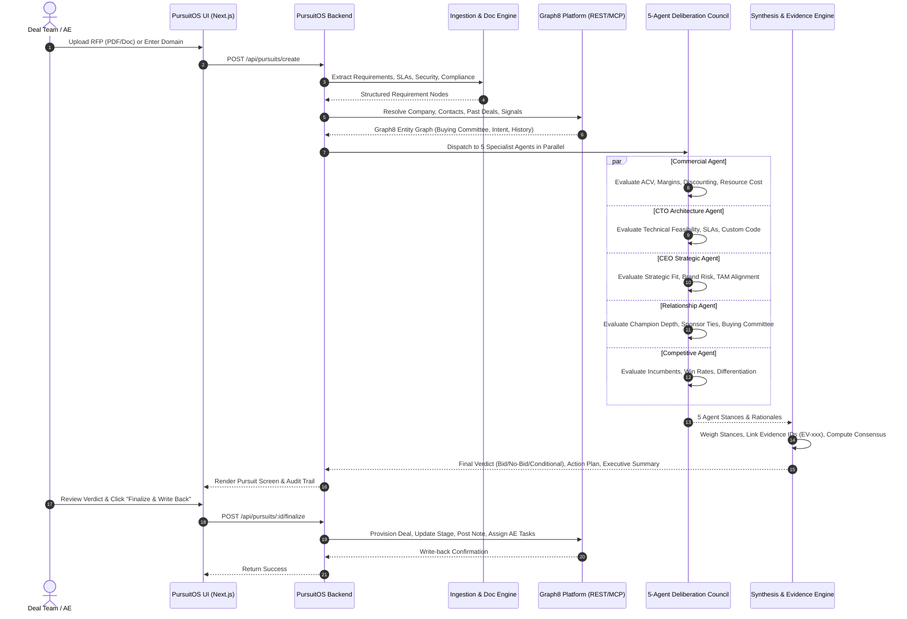

# 08 — PursuitOS System Overview & Deep-Dive Technical Analysis

> **Comprehensive Technical Analysis, Architecture Specification, Graph8 Integration Matrix, and Deliberation Mechanics for PursuitOS.**

---

## 1. Executive Summary & Thesis

### The Enterprise RFP Problem
In modern B2B enterprise software and services, the Request for Proposal (RFP) and deal qualification process is fundamentally broken:
- **Disjointed Committees**: Deal reviews require input from Solutions Architects (CTO), Commercial Pricing leads, Sales Leadership (CEO/VP), Account Executives, and Competitive Intelligence. Aligning these stakeholders takes **10 to 20 days**.
- **Confirmation Bias & Groupthink**: Eager sales teams frequently over-commit on unfeasible custom engineering, while risk-averse legal or technical teams block high-margin deals.
- **Data Disconnection**: RFPs are evaluated in isolation, ignoring existing customer relationship graphs, historical loss analyses, executive turnover, and real-time buyer intent signals present in the CRM.
- **Neglected Lost Pipeline**: Billions of dollars in closed-lost deals sit dormant in CRM databases, even when the catalyst conditions that caused the loss (e.g., lack of compliance certifications, executive blocker, incumbent vendor contracts) have completely changed.

### The PursuitOS Solution
PursuitOS establishes an **Autonomous Deal Intelligence & RFP Decision Engine** built directly on top of Graph8. Within minutes of receiving an RFP document or opportunity URL, PursuitOS:
1. Decomposes raw RFP documents into structured requirement schemas.
2. Resolves and enriches the target account against live Graph8 CRM entities, signals, and deal histories.
3. Concurrently runs a **Five-Member AI Council** (Commercial, CTO, CEO, Relationship, Competitive) to stress-test the opportunity from divergent executive viewpoints.
4. Generates a deterministic **Bid / No-Bid / Conditional** verdict with confidence scores, risk flags, and cited evidence.
5. Automatically syncs decisions, stages, notes, and task assignments back to Graph8.
6. Continuously monitors closed-lost deal portfolios via the **Revival Scanner** to surface re-engagement plays when catalyst triggers align.

---

## 2. End-to-End System Workflow



---

## 3. Deep-Dive: How Graph8 is Integrated

Graph8 is not used as an afterthought or a basic export target; it is the **central nervous system** of PursuitOS.

### Graph8 Capability Matrix

| Graph8 Data Domain | PursuitOS Application | Method / Protocol | Frequency |
|---|---|---|---|
| **Companies** | Account resolution, firmographic profiling, industry tagging | REST API (`/companies`) | Per Pursuit / Real-time |
| **Contacts** | Buying committee coverage, economic buyer & champion identification | REST API (`/companies/:id/contacts`) | Per Pursuit |
| **Deals** | Historical win/loss analysis, stage lifecycles, deal provisioning | REST API (`/deals`) | Real-time & Revival Scanner |
| **Intent Signals** | Active demand verification, keyword surge detection | Graph8 Signals | Deliberation Grounding |
| **Hiring Waves** | Scaling trajectory, tech stack additions, talent moves | Graph8 Signals / Talent | Deliberation Grounding |
| **Radar & Social** | Competitor intelligence, market sentiment, executive changes | Graph8 Radar / Social | Competitive Agent & Revival |
| **Notes & Timeline** | Audit trail storage, council verdict logging, evidence archiving | REST API (`/notes`) | Decision Write-Back |
| **Tasks** | Automated assignment of deal follow-ups and technical actions | REST API (`/tasks`) | Decision Write-Back |
| **Graph8 MCP Server** | Unstructured account exploration & dynamic tool discovery | Model Context Protocol | Agent Investigation |

### Deterministic Grounding & Anti-Hallucination
A core architectural principle of PursuitOS is **Evidence-Linked Grounding**:
- Every factual assertion made by an AI agent must be attributed to an `Evidence ID` (`EV-xxx`).
- Evidence items are categorized into:
  - `source: 'graph8'` (e.g., Graph8 contact title, historical deal win rate, hiring signal).
  - `source: 'document'` (e.g., RFP Section 4.2: Data residency in EU).
  - `source: 'model'` (inferred reasoning, explicitly flagged as synthetic).
- If an agent cannot attach an empirical Evidence ID to a risk claim, the synthesis engine downgrades the claim's weight during consensus formation.

---

## 4. Multi-Agent Council Architecture

### The Five Specialist Personas

```
┌─────────────────────────────────────────────────────────────────────────────┐
│                            5-MEMBER AI COUNCIL                              │
├───────────────────┬─────────────────────────────────────────────────────────┤
│ Agent             │ Primary Focus & Evaluation Lens                         │
├───────────────────┼─────────────────────────────────────────────────────────┤
│ 1. Commercial     │ • ACV Potential vs Implementation Overhead              │
│    Agent          │ • Margin health (Target > 75%)                          │
│                   │ • Contract duration, payment terms, penalty exposure    │
│                   │ • Resource allocation & ROI projection                  │
├───────────────────┼─────────────────────────────────────────────────────────┤
│ 2. CTO / Solution │ • Core capability match vs custom roadmap requests      │
│    Architect      │ • Availability SLAs (e.g., 99.99% with strict RTO/RPO)   │
│                   │ • Security compliance (SOC2 Type II, ISO 27001, FedRAMP)│
│                   │ • Multi-cloud & data residency mandates                 │
├───────────────────┼─────────────────────────────────────────────────────────┤
│ 3. CEO / Strategy │ • Strategic alignment with target enterprise tier       │
│    Agent          │ • Brand reputation impact & logo prestige               │
│                   │ • Opportunity cost vs existing high-priority pursuits   │
│                   │ • Expansion potential & Net Revenue Retention (NRR)     │
├───────────────────┼─────────────────────────────────────────────────────────┤
│ 4. Relationship   │ • Stakeholder mapping from Graph8 Buying Committees     │
│    Agent          │ • Identification of Economic Buyer, Champion, Evaluator │
│                   │ • Relationship warmth and historical touchpoint score   │
│                   │ • Internal political capital and sponsorship depth      │
├───────────────────┼─────────────────────────────────────────────────────────┤
│ 5. Competitive    │ • Active incumbent vendors in target account            │
│    Agent          │ • Historical win/loss ratios against competitors        │
│                   │ • Key product differentiators & defensibility angles    │
│                   │ • Competitor pricing vulnerabilities                    │
└───────────────────┴─────────────────────────────────────────────────────────┘
```

### Consensus Engine & Verdict Logic
The Synthesizer processes the five independent agent outputs through a weighted consensus algorithm:
1. **Hard Blockers**: If the CTO agent detects an impossible security or architectural violation, or the Commercial agent identifies a negative-margin contract, the verdict defaults to **`NO_BID`** regardless of other agents.
2. **Conditional Path**: If technical feasibility is high but stakeholder alignment is weak, or custom integrations are needed, the verdict issues **`CONDITIONAL_BID`** alongside concrete required conditions (e.g., *"Require sponsor meeting with VP Eng before RFP submission"*).
3. **Unanimous Bid**: High confidence across commercial, technical, and strategic dimensions triggers **`BID`** with an automated Go-To-Market execution plan.

---

## 5. Continuous Revival Scanner Engine

The **Revival Scanner** is an automated revenue recovery mechanism:

```
┌───────────────────────────┐     ┌───────────────────────────┐
│  Graph8 Closed-Lost Deals │     │    Live Graph8 Signals    │
│   (Historical Archive)    │     │  (Talent, Radar, Intent)  │
└─────────────┬─────────────┘     └─────────────┬─────────────┘
              │                                 │
              └───────────────┬─────────────────┘
                              │
                              ▼
        ┌───────────────────────────────────────────┐
        │      Revival Trigger Matching Engine      │
        │  • Incumbent Contract Renewal Window      │
        │  • Executive Sponsor / Champion Movement  │
        │  • Competitor Price Increase / Outage     │
        │  • New Compliance Certification Acquired  │
        └─────────────────────┬─────────────────────┘
                              │
                              ▼
        ┌───────────────────────────────────────────┐
        │          Revival Scoring Algorithm        │
        │        Score = f(Signal, Fit, Warmth)     │
        └─────────────────────┬─────────────────────┘
                              │
                              ▼
        ┌───────────────────────────────────────────┐
        │   Actionable Re-Engagement Playbook       │
        │  • Customized Executive Outreach Brief    │
        │  • Tailored AE Re-Engagement Battle Card  │
        │  • One-Click CRM Deal Re-Opening          │
        └───────────────────────────────────────────┘
```

---

## 6. Frontend Architecture & User Experience

PursuitOS features a bespoke design system built in strict adherence to modern Graph8 aesthetics:
- **Design Tokens**: Dark canvas (`#0D0F12`), structured surface layers (`#14171B`, `#191D22`, `#20252B`), and subtle graphite borders (`#292F36`).
- **Typography & Motion**: Inter font hierarchy with smooth micro-interactions, animated typewriter hero, and counter numbers.
- **Sticky Split Capability Showcase**: Dynamic two-column layout on the landing page where sticky narrative copy on the left remains pinned while 6 deep capability streams scroll vertically on the right.
- **Unified Navigation & Auth Boundary**: Decoupled marketing landing page from the authenticated AppShell workspace via `ConditionalShell`.
- **Interactive Pursuit Cockpit**: Real-time multi-agent deliberation view, evidence drawer, risk matrix, and one-click CRM sync status indicator.

---

## 7. Security, Execution Safety & Governance

PursuitOS implements rigorous enterprise security safeguards:
1. **Server-Side Secret Isolation**: No AI provider keys or Graph8 API tokens are ever transmitted to the client browser.
2. **Deterministic Execution Gating**:
   - `DEMO`: Simulated side-effects; zero risk of sending real emails or altering live customer accounts during presentations.
   - `SANDBOX`: Connects to test environments for staging evaluation.
   - `LIVE`: Explicitly authorized production CRM synchronization.
3. **Immutable Audit Trail**: Every deliberation run produces an `AuditEvent` with timestamp, model identifier, evidence hashes, and human sign-off records.
